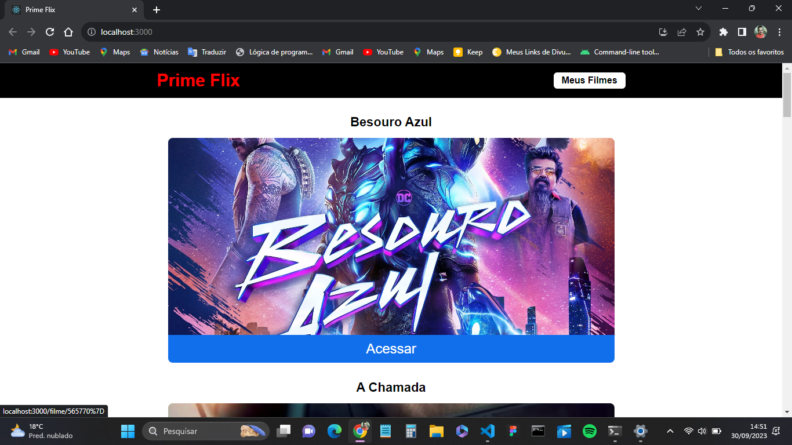

<h1 align="center"> Prime Flix </h1>

Prime Flix e uma aplicação em React.js que consome API da  The Movie DB Com atualização em tempo real de filmes.

  <a href="#-tecnologias">Tecnologias</a>&nbsp;&nbsp;&nbsp;|&nbsp;&nbsp;&nbsp;
  <a href="#-projeto">Projeto</a>&nbsp;&nbsp;&nbsp;|&nbsp;&nbsp;&nbsp;
  <a href="#-layout">Layout</a>&nbsp;&nbsp;&nbsp;|&nbsp;&nbsp;&nbsp;
  <a href="#memo-licença">Licença</a>

  

 

  

## 🚀 Tecnologias

Esse projeto foi desenvolvido com as seguintes tecnologias:
- React.js
- Yarn
- HTML e CSS
- JavaScript
- Git e Github

## 💻 Projeto

Prime Flix e um app que mostra os filmes em tempo real de acordo com atualização da plataforma TMDB.

## :memo: Licença

Esse projeto está sob a licença MIT.

---

